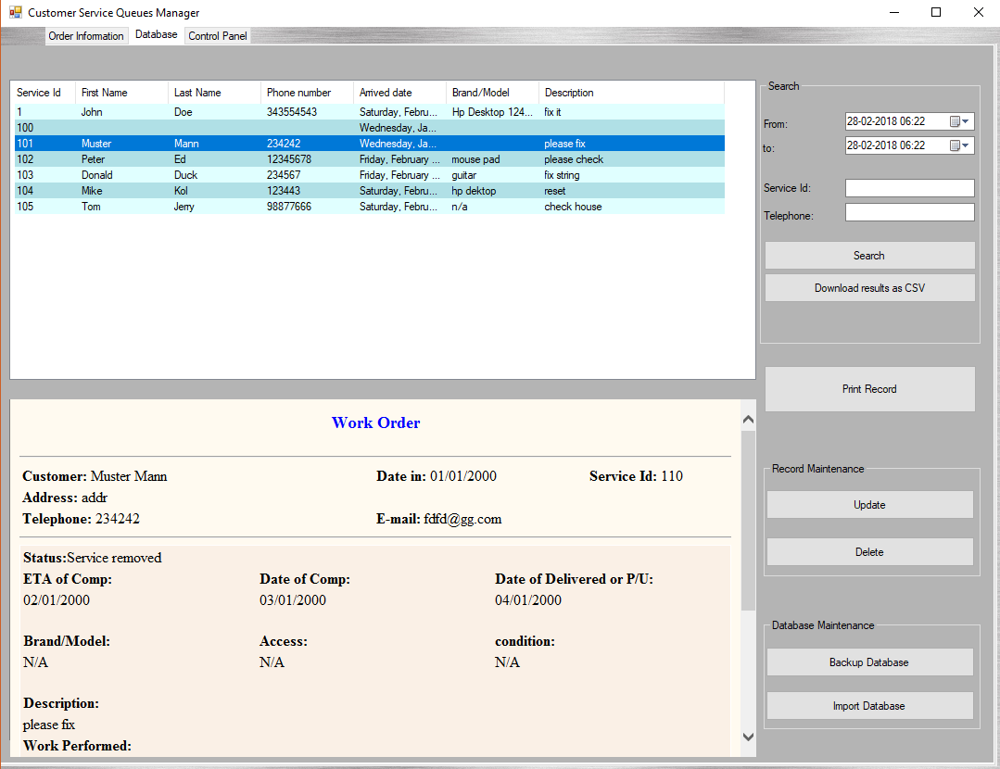
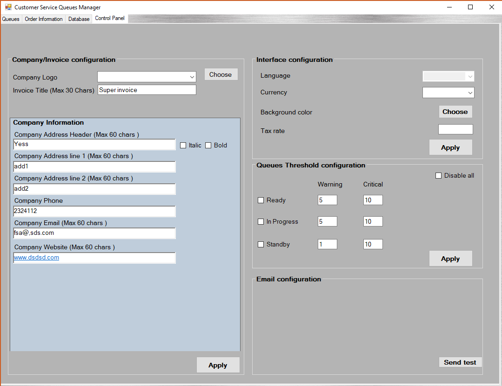

# Customer Queue Management System

## What is Customer Queue Management System?

It is a simple but highly effective GUI program that manages, orginizes, stores customer/service information. It can also download data as CSV, and create billing statements. The goal is to help small businesses' day-to-day processing. For better explanation please see examples, screenshots and features below.

## Features

- Queue page with big buttons for easy access using touch screen monitors.
- Language, currency and GUI customizations.
- Print to PDF statements.
- Search options.
- Database backups and other DB maintenance options.

## Screenshots

## Case examples

## Project Status

This is a work in progress. So, if you are intersted to contribute that'll be much appreciated!.

